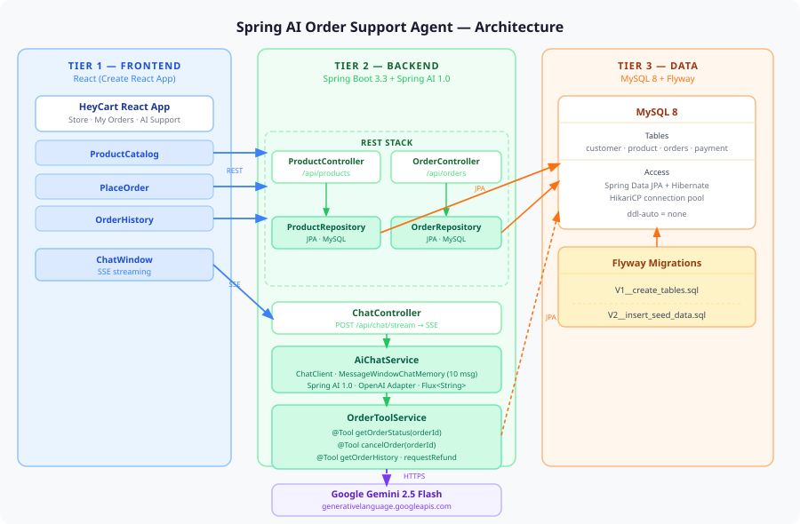
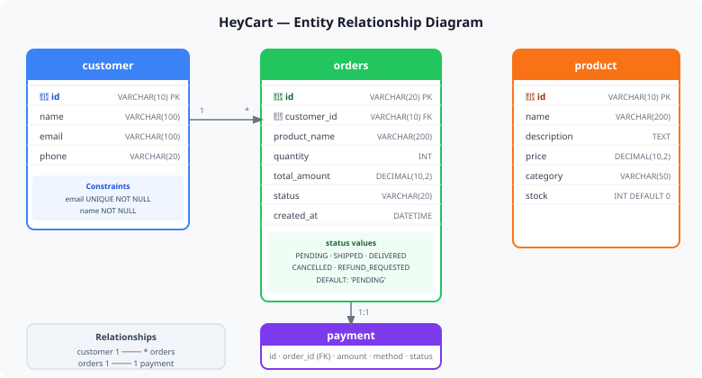
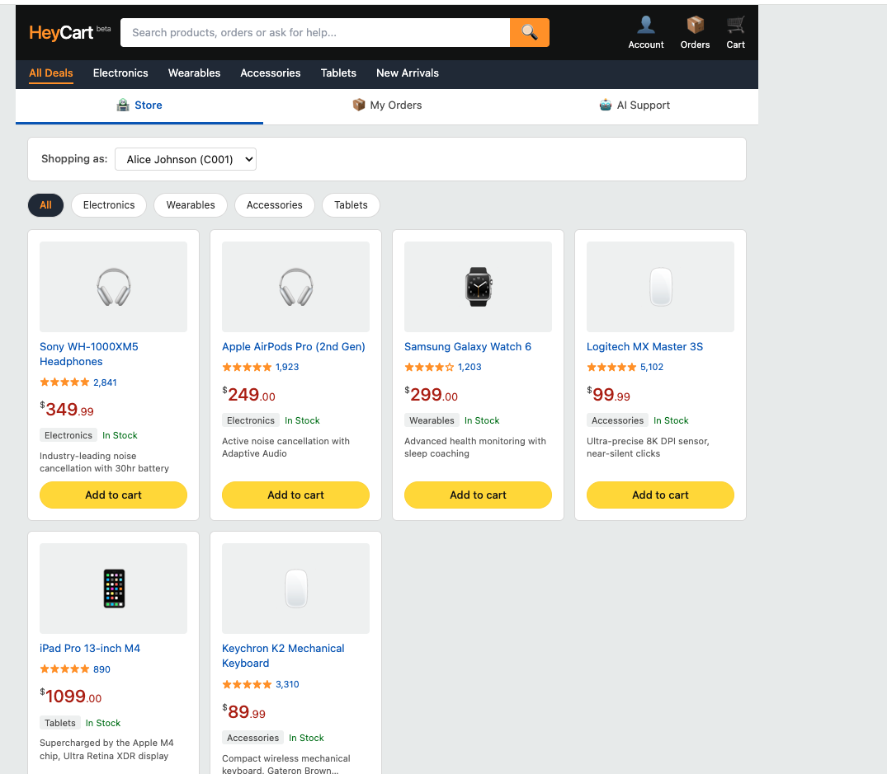
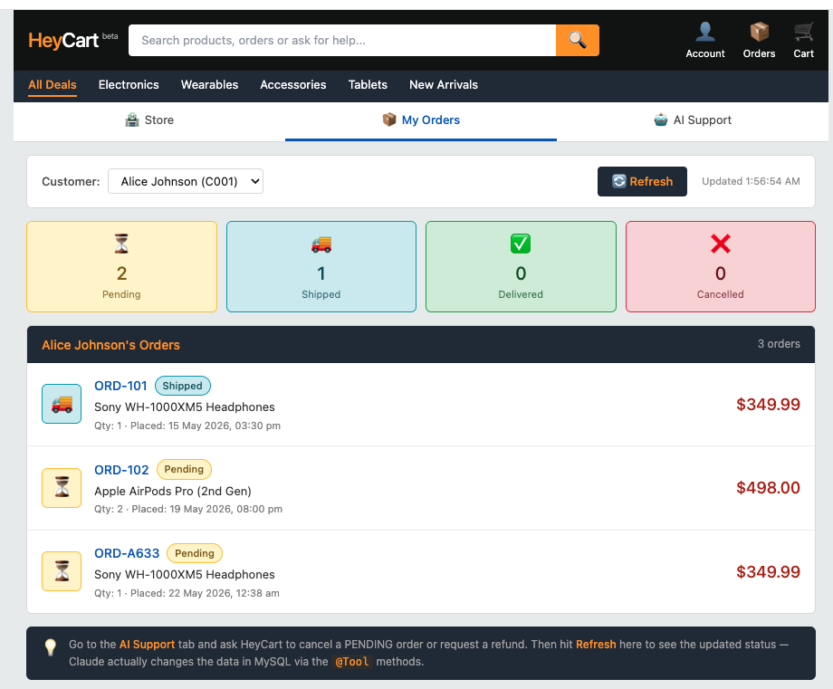
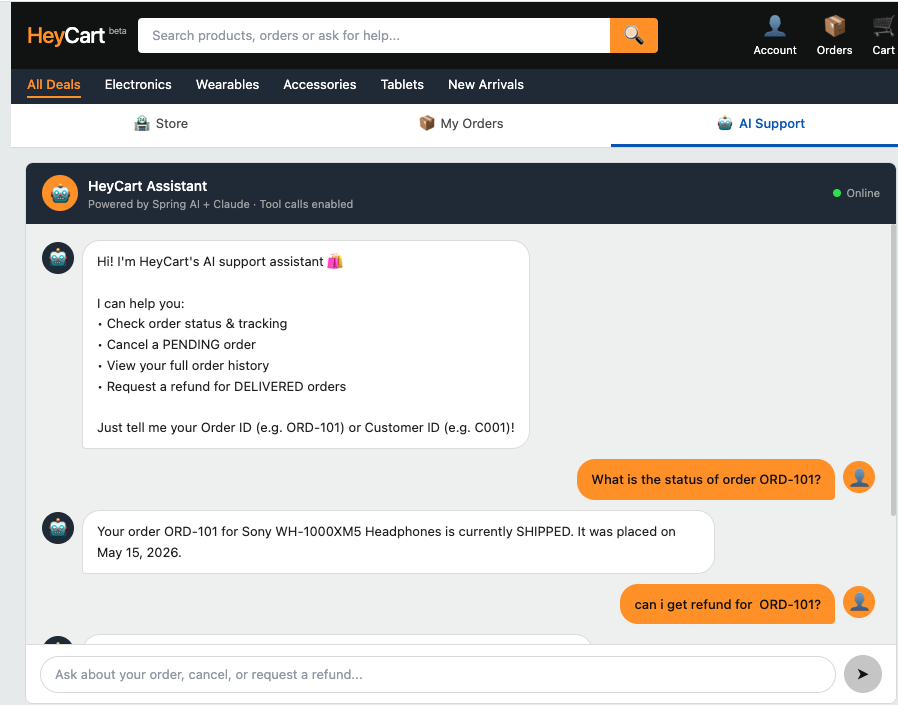
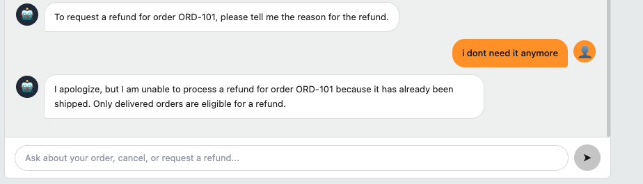
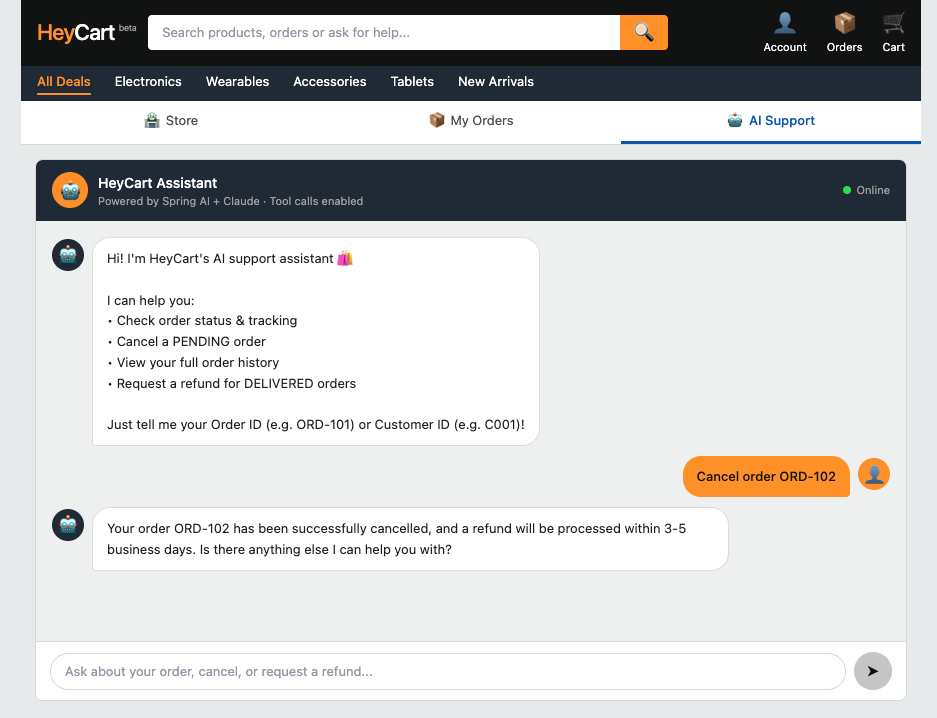

# 🛍️ Resolveai Order Support Agent

An AI-powered customer support agent for an e-commerce platform built with **Spring AI 1.0**, **Google Gemini 2.5 Flash**, **Spring Boot 3.3**, and **React**. Demonstrates how to connect an LLM to live database data using Spring AI's `@Tool` annotation — no LangChain, no boilerplate.

> 📖 **Article Series:**
> - [Part 1 — RAG Can't Cancel Orders: Building a Transactional AI Agent with Spring Boot](https://medium.com/@dineshchandgr/rag-cant-cancel-orders-building-a-transactional-ai-agent-with-spring-boot-part-1-31a367f72796?sk=c4a00e4e7937bc01501333b3f1a8ccc0)
> - [Part 2 — Code Walkthrough](#)
>

---

## ✨ What It Can Do

Ask the agent things like:

- *"What is the status of order ORD-101?"*
- *"Cancel my order ORD-102"*
- *"Show all orders for customer C001"*
- *"I don't need it anymore"* — it understands context from conversation history

Gemini decides which tool to call, fetches real data from MySQL, and streams the response token-by-token via SSE.

---

## 🏗️ Architecture



### How the agentic loop works

```
User message → ChatController
    → AiChatService sends message + tool schemas to Gemini
        → Gemini responds with tool call (e.g. getOrderStatus)
            → Spring AI executes @Tool method → hits MySQL
                → result sent back to Gemini
                    → Gemini streams final response → browser
```

Gemini never touches the database directly — it only decides *what* to call and *with what arguments*. Spring AI handles the execution.

---

## 🗄️ Database Schema



---

## 🛠️ Tech Stack

| Layer | Technology |
|---|---|
| Frontend | React 18, Create React App |
| Backend | Spring Boot 3.3.0, Java 21 |
| AI Orchestration | Spring AI 1.0.0 |
| LLM | Google Gemini 2.5 Flash |
| ORM | Spring Data JPA + Hibernate |
| Database | MySQL 8.0 |
| Migrations | Flyway |
| Streaming | WebFlux — `Flux<String>` SSE |
| Build | Maven |

---

## 🔑 Setting Up Your Gemini API Key

This project uses **Google Gemini 2.5 Flash** via Google AI Studio. New GCP accounts get **$300 in free credits** valid for 90 days.

### Step 1 — Create an API Key

1. Go to [aistudio.google.com](https://aistudio.google.com)
2. Click **Get API key** in the top navigation
3. Click **Create API key** → select or create a project
4. Copy the generated key

### Step 2 — Activate Your $300 Free Credit (removes rate limits)

The free tier limits you to 15 requests per minute and blocks some models. Activating billing unlocks full access at no cost until your $300 runs out.

1. Go to [console.cloud.google.com/billing](https://console.cloud.google.com/billing)
2. Click **Activate full account**
3. Add a payment method (you won't be charged until credits are exhausted)
4. Your account is now on **Tier 1 Postpay** — full rate limits, all models available

### Step 3 — Verify the key works

```bash
export GEMINI_API_KEY=your_key_here

curl -X POST "https://generativelanguage.googleapis.com/v1beta/openai/chat/completions" \
  -H "Content-Type: application/json" \
  -H "Authorization: Bearer $GEMINI_API_KEY" \
  -d '{"model": "gemini-2.5-flash", "messages": [{"role": "user", "content": "Hello"}]}'
```

A valid JSON response means you're ready to go. A `404` means the model name is wrong; a `401` means the key is invalid.

### Step 4 — Set the key before running

**macOS / Linux (terminal):**
```bash
export GEMINI_API_KEY=your_key_here
```

**IntelliJ IDEA:**
Run → Edit Configurations → Environment variables → add `GEMINI_API_KEY=your_key_here`

> **Never commit your API key.** The `.gitignore` in this repo already excludes `.env` files. Use environment variables only.

---

## 🚀 Quick Start

### Prerequisites

- Java 21+
- Maven 3.9+
- Node 18+ & npm
- Docker
- Gemini API key (see setup above)

### 1 — Start MySQL

```bash
docker run --name mysql-order-db \
  -e MYSQL_ROOT_PASSWORD=password \
  -e MYSQL_DATABASE=orderdb \
  -p 3306:3306 -d mysql:8.0
```

### 2 — Start the backend

```bash
cd backend
export GEMINI_API_KEY=your_api_key_here
mvn spring-boot:run
```

Flyway automatically runs `V1__create_tables.sql` and `V2__insert_seed_data.sql` on first startup — no manual SQL needed.

### 3 — Start the frontend

```bash
cd frontend
npm install
npm start
```

Open **http://localhost:3000** — React proxies API calls to `localhost:8080` automatically.

---

## 🔧 Key Spring AI Concepts

| Concept | How it's used |
|---|---|
| `@Tool` annotation | Exposes Java methods to Gemini as callable functions |
| `ChatClient.Builder` | Registers tools + system prompt |
| `MessageWindowChatMemory` | Retains last 10 messages per session |
| `MessageChatMemoryAdvisor` | Injects conversation history into each request |
| `Flux<String>` + SSE | Streams response tokens to the browser in real time |
| OpenAI Adapter | Points Spring AI's OpenAI client at Gemini's compatible endpoint |

### The @Tool methods

```java
@Tool(description = "Get the current status of an order by order ID")
public String getOrderStatus(String orderId) { ... }

@Tool(description = "Cancel an order. Only PENDING orders can be cancelled.")
public String cancelOrder(String orderId) { ... }

@Tool(description = "Get all orders for a customer by customer ID")
public String getOrderHistory(String customerId) { ... }

@Tool(description = "Request a refund for a DELIVERED order")
public String requestRefund(String orderId, String reason) { ... }
```

---

## ⚙️ Configuration

```properties
# application.properties
spring.ai.openai.base-url=https://generativelanguage.googleapis.com
spring.ai.openai.chat.completions-path=/v1beta/openai/chat/completions
spring.ai.openai.api-key=${GEMINI_API_KEY}
spring.ai.openai.chat.options.model=gemini-2.5-flash

spring.datasource.url=jdbc:mysql://localhost:3306/orderdb?useSSL=false&serverTimezone=UTC
spring.datasource.username=root
spring.datasource.password=password

spring.jpa.hibernate.ddl-auto=none
spring.flyway.enabled=true
```

> **Never hardcode your API key.** Use `export GEMINI_API_KEY=...` or set it in your IDE's run configuration.

---

## 🗂️ Project Structure

```
spring-ai-order-support-agent/
├── docs/
│   ├── architecture.svg
│   └── erd.svg
├── backend/
│   ├── pom.xml
│   └── src/main/
│       ├── java/com/shopeasy/agent/
│       │   ├── controller/
│       │   │   ├── ChatController.java       ← SSE endpoint
│       │   │   ├── OrderController.java      ← REST orders API
│       │   │   └── ProductController.java    ← REST products CRUD
│       │   ├── service/
│       │   │   ├── AiChatService.java        ← ChatClient + memory
│       │   │   └── OrderToolService.java     ← @Tool methods
│       │   ├── model/
│       │   └── repository/
│       └── resources/
│           ├── application.properties
│           └── db/migration/
│               ├── V1__create_tables.sql
│               └── V2__insert_seed_data.sql
└── frontend/
    └── src/
        ├── App.jsx
        └── components/
            ├── ChatWindow.jsx       ← SSE streaming client
            ├── OrderHistory.jsx
            ├── ProductCatalog.jsx
            └── MessageBubble.jsx
```

---

## 🔌 API Reference

### `POST /api/chat/stream`
Streams AI response as Server-Sent Events.

```bash
curl -N -X POST "http://localhost:8080/api/chat/stream?sessionId=test1" \
  -H "Content-Type: application/json" \
  -d '{"message": "What is the status of order ORD-101?"}'
```

### `GET /api/orders/customer/{customerId}`
Returns all orders for a customer.

### `GET /api/products`
Returns the full product catalog.

---

## 📸 Screenshots

### 🛍️ Store — Product Catalog



Browse products by category (Electronics, Wearables, Accessories, Tablets). Each product card shows live stock status, ratings, and price pulled from MySQL via the REST API.

---

### 📦 My Orders — Order History Dashboard



Order history for the selected customer with status summary cards (Pending, Shipped, Delivered, Cancelled). Data is fetched via `GET /api/orders/customer/{customerId}`. The hint at the bottom nudges users to try the AI Support tab — changes made by the agent are reflected here after refresh.

---

### 🤖 AI Support — Order Status & Refund Request



The AI Support tab streams responses via `POST /api/chat/stream` using SSE. Here Gemini calls `getOrderStatus("ORD-101")` → hits MySQL → streams back the result. The follow-up refund request triggers `requestRefund()` in the same conversation using memory.

---

### 🧠 Context-Aware Conversation



The agent understands follow-up messages without repeating the order ID. "i dont need it anymore" correctly maps to the refund request from earlier in the conversation — powered by `MessageWindowChatMemory` retaining the last 10 messages per session.

---

### ❌ Order Cancellation



Cancelling order ORD-102 — the agent calls `cancelOrder("ORD-102")`, updates the status in MySQL via JPA, and confirms in natural language. Only `PENDING` orders can be cancelled; the `@Tool` method enforces this rule and returns an error message to Gemini if the status check fails.

---

## 📄 License

MIT
